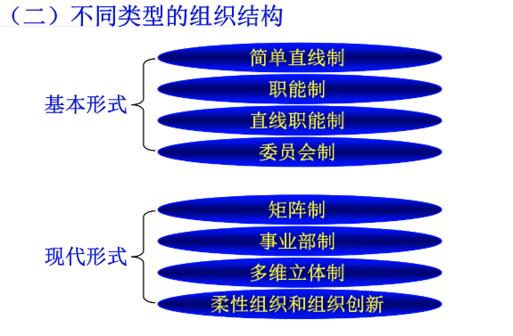
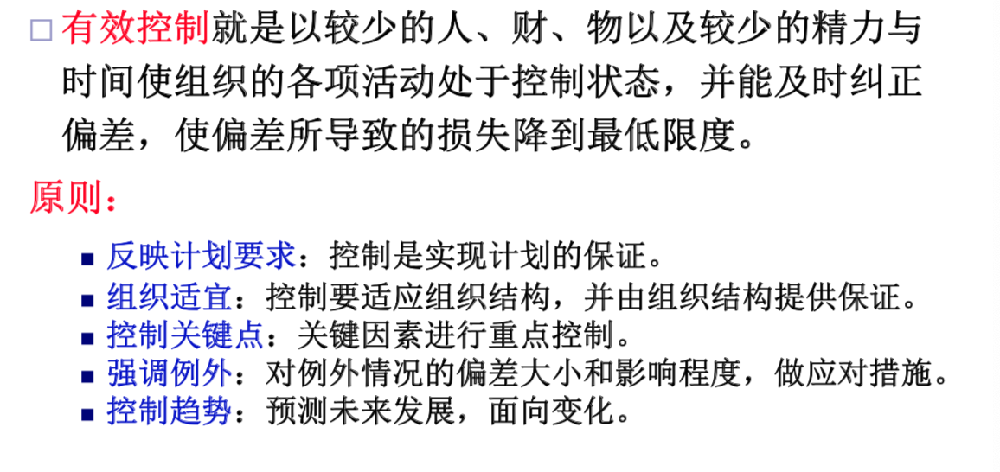
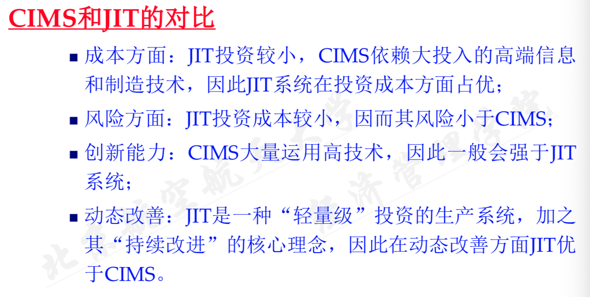
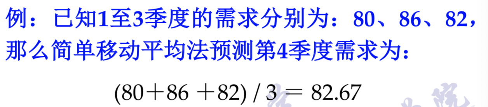
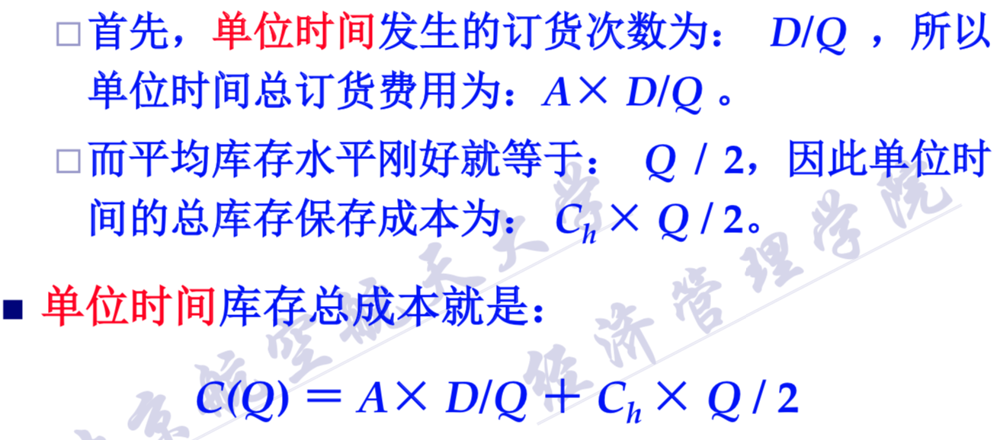

# 经济管理笔记

## 第一章 经济与管理概述

### 经济与管理的基本概念

#### 经济问题与经济

- 人的欲望的无限性和资源的稀缺性

- 经济学研究的基本问题

  - 生产什么

  - 怎么生产

  - 为谁生产（分配问题）

  - 经济总量问题：社会既定的生产资源总量是否被充分利用以及如何得以充分利用？

    其中，前三个问题是微观经济学研究的主要问题，第四个是宏观经济学研究的主要问题。

- 理性经济人假设

  - 经济决策的主题都被假定为是理性经济人，具有利己的理性，所追求的目标是使自己的利益最大化。

#### 管理的基本概念

- 管理定义：管理者在动态环境下通过对组织内部资源及整合的组织外部资源进行有效的**计划、组织、 领导和控制**以实现组织目标的科学和艺术过程。 
- 管理的基本职能
  - 计划职能
  - 组织职能
  - 领导职能
  - 控制职能

- 管理者的层次：基层、中层、高层
- 管理者需要的技能：概念技能、人际技能、技术技能
  - 管理者层次越高，所需要的概念技能越多、概念技能越少

- 管理者的工作内容： 传统（例行）事务、沟通、人力资源管理、网络联系
  - 越是成功的管理者在传统的管理工作方面花费的精力越少

### 经济学的发展历史

#### 启蒙阶段（重商主义、重农学派）

- 威廉·配第
  - 代表作《赋税论》
  - 《政治算术》，奠定了基本的经济学研究方法：**经验归纳和数学方法**。

- 重商主义
  - 出口，或者贸易顺差是国家支付的唯一手段
  - 政府中央集权化与独立的商业企业最有效的结合起来（典型代表：英属东印度公司）

- 重农主义
  - 产生地租的土地是产品的唯一源泉
  - 代表人物：弗兰斯瓦·魁奈

#### 古典经济学

- 亚当斯密发表《国富论》，标志着古典经济学的诞生。
- **自由竞争**是古典经济学派的不二信条。
- 亚当·斯密：现代经济学之父
  - 斯密对经济学影响最大的是**经济自由主义**思想。 
  - 科学抽象法和经验归纳法

- 大卫·李嘉图：古典经济学的杰出代表
  - 代表作《政治经济学及赋税原理》：基于**劳动价值**学说

- 约翰·穆勒：古典经济学的集大成者
  - 代表作：《政治经济学原理》

- 其他人物：
  - 马尔萨斯：《人口原理》 ，为资产阶级辩护。
  - 萨伊：《政治经济学》，亚当斯密学说的系统化者，提出：**效用价值论**和**供给创造需求**。
  - 卡尔·马克思：发展了剩余价值学说。

#### 新古典经济学

- 边际主义革命
  - 经济学从古典经济学强调的生产、供给和成本，转向 现代经济学关注的消费、需求和效用。
  - **边际效用**概念的引入实现了这种重点转移

- 马歇尔：新古典经济学的奠基者，代表作《经济学管理》

#### 凯恩斯主义

- 凯恩斯：宏观经济学之父
- 凯恩斯革命
- 代表作：《就业、利息与货币通论》

#### 后凯恩斯主义

新古典综合派、新剑桥学派、新自由主义等等。

### 现代管理思想的演变

- 泰勒：科学管理之父

## 第二章 微观市场机制分析

### 市场需求分析

#### 需求及其表达

- 需求的定义：消费者在某一特定的时期内和一定的市场上在**各种可能的价格水平**下**愿意**而且**能够购买**的 某种商品或服务的数量。 

- 需求的决定函数是一个线性函数。

  

- 需求曲线

  

- 需求定律：商品的需求量和与价格成反方向变化。
  - 需求定律的解释：**替代效应**和**收入效应**
  - 正常商品：收入越高，需求越高。
  - 一般低档品：收入越低，需求反而上升；但替代效应带来了更多的需求的下降。
  - 吉芬品：不符合需求定律的低档品。

#### 市场需求弹性分析

##### 需求的价格弹性

- 价格弹性越大，越富有弹性，临界值为1.

  

- 

##### 需求的收入弹性

- 需求量变动 / 收入变动
- 

- 根据需求的收入弹性将商品分类

  - 低档品：收入弹性为负值，即该商品的需求量和收入水平成反方向变化。
  - 正常品：收入弹性为正值，即该商品的需求量和收入水平成同方向变化。
  - 恩格尔定律：家庭或国家越富裕，食物需求的收入弹性就越小。

##### 需求的交叉价格弹性

- 商品X的需求量变动，除以商品Y的价格变动。
- 
- 交叉价格弹性为正：X和Y互为替代品，比如苹果和梨。
- 交叉价格弹性为负：X和Y互为互补品，比如汽车和汽油。
- 交叉价格弹性为零：两种商品相互独立。

### 市场供给分析

#### 供给及其表达

- 定义：指生产者在某一特定的时期内和一定的市场上在**各种可能的价格水平**下**愿意**而且**能够**提供出售的该商品或服务的数量。 

- 供给函数一般是一个线性函数。

  

  

- 供给定律：一般商品的供给曲线向右上方倾斜，即供给量与价格成同方向变化。
  - **土地**的供给长期来看基本上是固定的，所以其供给曲线和横轴是垂直的。
  - 在某些条件下，劳动力的供给曲线（其价格就是**工资**了）并不一定是向右上方倾斜。

#### 供给弹性分析

- 供给的价格弹性：表示在一定时期内当一种商品的价格变化1%时所引起的该商品的供给量变化的百分比。 
- 
- 

- 供给的成本弹性一般为负值，即，成本提高会导致供给的降低。

### 市场均衡与政府政策

#### 市场均衡

- 均衡：经济活动中有关变量在一定条件下相互作用，达到相对静止或稳定的状态。分为局部均衡和一般均衡。

- 均衡价格

  

- 过剩与短缺

  

- 供求定律

  

#### 应用市场均衡原理分析政府政策

##### 规定价格上限或者规定价格下限

就这样，很简单。

##### 价格补贴和税收

自己画图分析就行。下面是征税时的分析用的例子。

然后参考一下课堂作业。

## 第三章 生产决策与市场结构

### 生产函数

#### 要素投入与生产函数

- 四类主要生产投入要素：劳动力、资金、土地、企业家才能（管理）
- 一定的技术经济条件下，投入产出的对应关系称为生产函数。
- 

#### 边际报酬递减规律

- 平均产量

  

- 引入边际产出（边际产量），等于产量对某一生产投入要素的偏导数，实际意义为，增加一定量的某要素投入，会增加多少产出量。

  

- 边际产量和平均产量的交点是平均产量的最大点

  

- **规模报酬**：因为要素投入规模变化而导致的产量的变动称为规模报酬。

#### 等产量线与生产要素可替代性 

- 等产量线：产量相等的生产要素组合形成的曲线，即总产量函数的等高线或等值线。下图就是一个很典型的等产量线图。

  

- 生产要素的可替代性：增加其中之一的投入而减少其他对应要素投入，可以维持相同的产出。这种可替代性分为三类：

  - 完全相互替代，对应的等产量线应该是完全线性的（当然可以有分段）。

    

  - 不完全替代，对应的等产量线是凸向原点的曲线。

    

  - 完全不能替代，对应的等产量线是直角折线。

    

- 边际技术替代率

  

### 投入要素最佳组合

#### 等成本线

#### 投入要素组合

##### 成本一定时，找最大产量

- 基本方法：找一条等产量线，使之与给定预算的等成本先相切，切点就是生产要素最佳组合点。

  

##### 产量一定时，找最小成本

- 基本方法：找一条等成本先，使之与给定的等产量线相切。

  

##### 例题

### 成本与利润函数

#### 成本

- 基本概念

  

- 成本函数

  

#### 利润函数与生产决策

##### 线性收益/成本函数的边际分析 

- 额外产量决策

  

  

- 降价促销决策

  - 基本思路还是把销售函数曲线和成本函数曲线都画出来，然后比较折线交点处。基本就是这样了。

  

  

### 市场结构和生产决策

这里现在不想看，感觉应该也不会考，考试之前有时间再看吧。

## 第四章 宏观经济分析

### 现代宏观经济学的研究对象

#### 宏观经济学定义

宏观经济学是以整个国民经济活动为研究对象，主要研究国民收入、社会就业、物价水平、经济增长速度、经济周期波动等全局性的问题。 

#### 宏观经济学的研究对象

- 总产出
- 通货膨胀
- 失业
- 宏观经济政策

### 国内生产总值

#### 国内生产总值的基本概念

- 国内生产总值（GDP）：在一个国家的国土面积上，在一定时期内生产的所有最终产品和劳务的市场价值。
- 理论上，计算GDP的时候，计算总消费者的总支出和计算总生产者的总收入是一样的，**总支出和总收入应该是相等的**。

#### GDP的核算方法

- 生产法：计算生产中的价值增值，把一段时期内地额生产服务活动的价值增值加总求和，但该方法不常用。

- 收入法：通过核算一定时期内获得的收入来计算。

  

- 支出法：又称产品支出法、产品流动法、最终产品法，**是我国采用的GDP核算方法**，它从社会对产品的消费角度出发，把当期用以购买最终产品和劳务的货币加总，作为当期生产的GDP。 

  

- 例题

  

#### 经济增长

##### 名义GDP和真实GDP

- 
- 
- 
- 

##### 经济增长

### 失业与通货膨胀

#### 失业

- 失业人口必须满足三个条件：
  - 有劳动能力
  - 愿意就业
  - 现在没有工作
- 
- 失业的种类
  - 自愿失业和非自愿失业
  - 周期性失业、摩擦性失业和结构性失业
  - 自然失业和周期性失业
    - 只有自然失业，没有周期性失业的经济状态，称为**充分就业**。

#### 通货膨胀

- 当一个经济体中的大多数产品和劳务的价格在一段时间内持续普遍上涨时，就称这个经济系统经历着**通货膨胀**。

##### 通货膨胀衡量指数

- 消费物价指数CPI
  - 
  - 
  - 通货膨胀率
    - 
- 批发价格指数WPI
  - 
- GDP平减指数：名义GDP和真是GDP的比率。

##### 通货膨胀的种类

- 按照通货膨胀的程度可以分为：**温和的通货膨胀**、**奔腾的通货膨胀**、**超级通货膨胀**、**恶性通货膨胀**。
- 按照通货膨胀对价格的影响，将其分为**平衡的通货膨胀**和**非平衡的通货膨胀** 。
- 按照公众对通货膨胀的预期，分为**未预期到的通货膨胀**和**预期到的通货膨胀**。 

##### 通货膨胀的原因

- 费雪方程与货币数量论
  - 货币主义流派认为，通货膨胀是一种纯货币行为。
- 总需求和总供给论
  - 多数通货膨胀是由需求拉动和成本推动综合作用造成的。 

- 结构性通货膨胀论

### 经济周期与宏观经济政策

#### 经济周期

- 基本概念
- 经济周期的原因
  - 内生经济周期理论
  - 外省经济周期理论
  - 综合论

#### 宏观经济政策

##### 政策目标

- 实现**充分就业**、**价格稳定**（通货膨胀率控制在3%到5%以内）、**经济持续均衡增长**、**国际收支平衡**

##### 政策构成：财政政策+货币政策

- 财政政策

  - 财政政策是指国家通过调节政府的**支出**和**收入**水平（如税收和借债水平）以影响总需求状况，进而达到保持经济的持续增长和高就业率的目的而采取的宏观经济政策。 

  - 政府支出包括**政府购买**、**政府转移支付**和**政府债券利息支付**。
  - 政府收入包括**税收**和**政府公债**。
  - 财政盈余和财政赤字。

- 货币政策

  - 货币政策是指**中央银行**通过控制货币市场中货币供应量、以及调节利率进而影响投资和整个经济支出以达到一定经济目标而采取的宏观经济政策。 
  - 货币政策工具主要包括**法定准备金**、**公开市场业务**和**再贴现率**。
  - 法定准备金：调增，可以降低货币乘数，最终减少货币供给；调减，可以增大货币乘数，最终增加货币供给。这一政策手段很少使用。
  - 公开市场业务是指**中央银行**在金融市场上公开买卖政府债券（**不是新发行**）以控制货币供给量。中央银行购买债券时，将增加流通中货币的供给数量；出售债券时，相当于回笼货币。
  - 再贴现率
    - 央行调高再贴现率，将抑制商业银行从央行借入准备金，从而减少货币供给量； 
    - 央行调低再贴现率，将鼓励商业银行从央行借入准备金，从而增加货币供给量。

## 第五章 管理的职能

### 计划

#### 计划的作用和类型

- 计划的正面作用：是其他管理职能的前提和基础，并且渗透到其他管理职能之中，是管理过程的中心环节。

- 计划的消极作用：可能过于集权和自上而下，使计划脱离实际；所有的计划都建立在对未来的假设之上，这种假设有时可能是错误的；计划需要考虑变化。

- 计划的类型

  

### 组织

#### 组织的基本概念

##### 组织的含义

- 实体含义：表示人类组成的有机整体。
  - 三要素：明确的目标、系统性的结构、由人组成，人群数量大于等于2
- 职能含义：人与人或人与物之间资源的配置活动过程。

##### 组织的职能

- 职位设计
- 部门划分
- 职权配置
- 人力资源管理
- 协调整合
- 组织变革：环境变化促使组织变革；组织目标变化促使组织变革

#### 组织结构设计与组织结构形式

组织结构设计需要考虑的因素包括：**管理层次与跨度**、**工作专业化**、**部门化**、**命令链**、**集权与分权**、**正规化**。

#####管理层次与管理跨度、幅度

- 管理跨度：管理人员能**直接管理**的下属数量。
- 两类管理跨度：窄管理跨度、宽管理跨度

##### 工作专业化

- 简单来讲就是做好分工，使每个人的工作专业化，目的是提高工作效率。

##### 部门化

- 在工作专业化把工作细分之后，按照各部分活动的特点将它们有机的组合起来，以便各部分工作相互协调，形成各职能部门。

##### 命令链(职权和统一指挥)

##### 集权与分权

##### 正规化

- 组织中的工作符合正式规范与特定标准的程度。

####组织的人力资源

人员招聘、甄选、扩展与训练、薪酬设计与绩效评估。

### 领导

#### 领导职能概述

- 领导：通过对人们施加有效影响而使其具有强烈意愿并努力达成组织目标的一种艺术或一种过程。
- 领导职能的单个要素：人、影响和目标

#### 激励

##### 激励与绩效

- 
- 

##### 几种激励理论

- 马斯洛层次需求理论：生理需求、安全需求、社会需求、尊重需求、自我实现需求
- 双因素理论——赫茨伯格：保健因素、激励因素
- 麦克利兰需求理论：人的三种需求：成就需求、权利需求、归属需求
- 公平理论：一个人得到的报酬的多少和他的付出是相对应的。
- 期望理论：

### 控制

#### 控制的基本概念和基本类型

- 控制的内涵：根据组织的计划和事先设立的标准，监督检查各项组织活动的开展过程和结果，并根据偏差调整行动或计划，使计划和实际相吻合，从而保证目标事先的过程。
- 控制与计划、组织、领导的关系。
- 控制的内容：人员控制、财务控制、作业控制、信息控制、绩效控制
- 控制的类型：
  - 按照控制点位于管理活动进程的阶段划分：前馈控制(预先控制、事前控制)、过程控制、反馈控制。
  - 按控制主体的不同划分：外部控制、自我控制
  - 按控制信息的性质划分：反馈控制、前馈控制
  - 按不同的控制手段划分：预防性控制、纠正性控制

#### 控制的原则和技术

##### 有效控制的原则

##### 控制的技术和方法

包括**预算控制**、**作业控制**和**审计控制**三类。

- 预算控制的种类：经营预算、投资预算、财务预算
- 作业控制：成本控制、采购控制、质量控制、库存控制
- 审计控制：包括**财务审计**和**管理审计**两类，也可以分为**外部审计**和**内部审计**两种。

## 第六章 企业与管理

### 企业与现代企业制度

#### 企业的类型

##### 按照企业的法律形式分类

- 独资企业
  - 非法人型独资企业：法律上为自然人企业，**缴纳个人所得税**，对企业债务承担**无限责任**。
  - 法人型独资企业：**有限责任**，法人型企业仅需以法人资产(企业资产)对企业债务承担有限责任，与私人资产无关。
- 合伙企业：由两个或两个以上的出资者共同出资创建，实行联合经营和控制的企业。
  - 普通合作企业：合伙人承担**无限连带责任**。
  - 有限合伙企业:由普通合伙人和有限合伙人联合组成;普通合伙人对企业债务负无限连带责任，而有限合伙人仅以出资额为限承担有限责任。
- 公司制企业
  - 公司是指依法成立、以营利为目的、独立的法人实体，是目前最重要的现代企业组织形式。
    - 最基本的公司组成包含三个利益方：股东、董事会、高层管理者。
  - 股份有限公司：注册资本由等额股份构成，股东承担有限责任，股东数量没有限制，股份可以自由转让。
  - 有限责任公司：可以理解为多人出资的"法人型独资企业"。

- 合作制企业：如农村供销合作社的股份合作制:分红的权重不仅限于出资额，还和劳动付出有关，使劳动和股本共同参与红利分配 ，实现了按劳分配与按股本金分配的有机结合。

##### 按照企业的自然属性分类

这里就有各种各样的分类方法了。不再赘述。

#### 现代企业制度

##### 基本内容

- 企业制度**以产权为基础**。
- 包括三个方面：企业产权制度、企业组织制度、企业管理制度。
- 现代企业制度要素包括：产权制度、法人制度、有限责任制度、管理制度。

- 现代企业产权制度：**出资者的所有权和法人财产权相互分离，是现代企业制度的核心**。
- 现代企业法人治理制度：股东大会（最高权力机构）、董事会（治理）、监事会（监管，对股东大会负责，对董事会行使监督权）、管理层。
- 现代企业的有限责任制度
- 现代企业管理制度
- 现代企业制度的特点：**产权明晰**、**权责明确**、**政企分开**、**管理科学**。

## 第七章 生产系统结构与战略

### 生产系统结构

#### 生产线布置的基本形式

- 首要目标：是**物料流动最快、费用最小、搬运量最少、搬运时间最短**。
- 三类基本布置：**工艺式、对象式和固定式**。
- 
- 
- 
- 

#### 生产管理方式与客户定制分离点

##### 生产管理方式

- **备货生产(MTS，make to stocks)**，根据需求预测，生产并储备产品库存，等待顾客购买，称为**推式生产**。
- **按订单生产（MTO，make to orders）**，拿到顾客订单之后才根据订单需求开始生产，称为**拉式生产**。

##### 客户定制分离点

- 客户分离点越靠近上游，该产品的定制能力越强，反之，该产品的定制能力越弱。

### 竞争优势与生产战略

#### 产品竞争战略

##### 赢得订单标准

- 订单资格要素(最基本前提，意思是你得有资格得到订单，产品应该达到**立足市场标准(MQC)**)
- 订单赢得要素(产品应达到**赢得订单标准(OWC)**)。

##### 产品的通用竞争策略

- **成本领先战略**
- **差异化战略**
- **集中化战略**

#### 生产系统的战略性构造

##### 五类基本生产系统

- 单件小批型
- 批量流水型(比如服装、医药生产、通用件制造等)
- 节拍流水型
  - 人工节拍流水线(肯德基、麦当劳等)
  - 机器节拍流水线(汽车、加点、家具等)
- 流程型(冶炼、化工、制药等)

##### 生产系统结构-功能关系悖论与战略选型

- 没有哪种生产类型能同时在**物流连续性(效率)**和**应变能力(柔性)**两方面都达到最高水平。

#### 世界级制造

##### CIMS与JIT

- CIMS：计算机集成制造系统
- JIT： 准时制生产，在必要的时间生产必要数量的正确产品，是日本丰田公司创立的现金制造方式，主张持续改进和追求零库存。
- 

##### 大规模定制/大量定制

##### 个性化制造/个性化定制

## 第八章 产品设计

### 跨职能产品开发过程

#### 产品开发方法

- 循序渐进的产品开发方式
  - 各环节可能彼此脱节，方案多次修改，出现“**设计-制造-修改设 计-重新制造**”循环，产品开发周期长、成本高、质量难保障。 
- 集成产品开发方法（IPD）：**产品开发相关的各个职能领域的人员同时参与产品开发**。
  - 并行工程：**将串行作业转变为并行作业**。

#### 集成产品开发工具：质量功能展开(QFD)

这里要是实在想了解的话就看PPT吧。

### 面向顾客的产品设计

#### 以用户为中心的设计和全部用户体验

##### 以用户为中心的设计

- 以用户为中心的设计思想认为产品的成败最终取决于用户的满意度。
- 产品的设计策略应该满足用户的需求为基本动机和最终目的。

##### 全部用户体验

#### 顾客价值、价值分析和价值工程

- 顾客价值：指的是因使用产品而为顾客带来的利益。
- **价值分析方法**用于分析处于生产过程中的产品价值与功能。
- **价值工程**则主要用来在产品投产前削减成本。
- 

#### 顾客满意度模型(Kano Model)

基本需求、期望需求、兴奋需求

### 面向制造和装配的产品设计

#### 面向制造的产品设计 ( DFM)

- 设计的产品**能制造**，并且**易于制造**。

#### 面向装配的产品设计 ( DFA)

-  通过零部件和装配方法设计减少装配的复杂性，从而达到提高产品可制造性的目的。

#### 好的实现方法

- **零部件标准化和通用化**
- **模块化设计**：实现定制化的关键是模块化

## 第九章 生产运作流程设计

### 流程型结构和职能型结构

#### 职能视角下的组织形式及其特点

- 各**职能部门**根据自身职能分工完成分配的工作。
- 缺点：为顾客服务的完整流程可能被割裂，完成产品的活动在不同部门之间的传递逻辑比较复杂。

#### 流程视角下的组织形式及其特点

- 通过**流程集成**减少企业内部不必要的物料和信息的传递时间，从而减少了不必要的部门间的协调过程，提高了流程效率。

#### 组织流程化与职能化的综合优化

- 职能型组织：较高的资源效率，较低的过程效率(各部门之间的协调工作比较复杂，流程效率较低)。
- 面向流程的组织(聚焦型组织方式)：较高的过程效率，较低的资源效率。
- 复合型组织
  - 

### 生产运作流程的分类和选择

#### 生产运作流程的分类

- 根据标准化程度及产量的大小分类
  - 单件小批型生产流程
  - 批量流水型
  - 大量流水型(流水线型)
    - 在实现产品和服务的**模块化**、零部件的**标准化和通用化**设计与生产后，大量流水生产可实现**大规模定制**。
  - 连续流程型(产品产量很大，品种很少，比如电力、冶炼、石油等)
- 根据满足需求的方式分类
  - 面向库存生产
  - 面向订单生产
  - 混合型流程
- 根据流程在企业创造价值中的作用分类
  - 价值创造流程
  - 支持性流程

#### 生产运作流程结构的选择

### 流程的描述、分析与评价

#### 流程分析的目标

- 理解流程
- 监控流程
- 确定重点流程
- 解决问题

#### 确定流程改进的对象

- 流程的重要性
  - 根据对实现**订单赢得要素**的影响排序
- 流程的绩效
- 流程优化的可行性
  - 范围、费用、人员三个方面

#### 流程描述

- 流程描述方法
  - 文本法
  - 图形法
    - 工艺流程图、流程程序图、跨职能流程图
  - 表格法
- 从总到分、从上到下

#### 流程分析与评价

- 流程存在的问题包括流程**冗余、浪费和资源冲突、流程串行、反复**等问题。
- 流程的价值分析：流程中是不是所有的活动都带来了价值？有没有冗余？
- 流程的精益水平评价
  - 最常用的时间指标是**流程周期**。
  - 制造流程的周期要素包括：作业时间、等待时间 、移动时间、检验时间、准备时间等。
  - 

### 流程改进及流程再造

- 根本性的改变：流程再造
- 经常性的逐步改进：持续改进

## 第十章 库存和生产管理

### 库存管理

#### 需求预测

- 需求变化的影响因素：**趋势因素、季节性因素、周期性因素、随机因素**。
- 主观预测法：可能是单独的某人，也可以是参与预测的专家团队。
- 客观预测
  - 时间序列预测
    - **移动平均法**，牛逼一点的话，还可以**加权移动平均**
      - 
    - **指数平滑法**
      - 
      - 
    - 其他方法
  - 因果预测模型

#### 经济订货批量

- 库存与库存成本
  - 保存成本(持有成本)
  - 订购成本(业务洽谈、运输、验收等形成的费用)
  - 缺货惩罚成本
- 经济订货批量(EOQ)模型
  - 
  - 
  - 

### 批量问题与生产计划

#### 经济生产批量

- 批量现象表明：**应该在适当的时间生产适当数量的产品**，从而形成生产计划。

#### 生产计划

### MRP和JIT系统

#### MRP——推式生产计划

- **物料需求计划**将成品需求计划通过**产品物料清单(BOM)**分解为原材料、零部件的生产或采购计划，并下达给各生产单位启动生产。
- 
- 把上面那张图搞懂，知道怎么填，知道怎么算时间就OK了。

#### 准时制生产(拉式生产)——JIT

- 基本概念：准时制，就是要求产品线各环节将**必要的产品**(原材料、零部件或成品)，以**必要的数量**和**完美的质量**，在**正确的时间**送往**正确的地点**。
- "零库存"
- 需求拉动式生产方式
- 快速响应，尽量缩短生产周期
- 注意，JIT在做计划分解时，也一样要用到MRP的BOM分解和计算，但是他们的区别是：**JIT基于实际订单进行计划分解，而MRP是根据需求预测进行计划分解**。
- 看板管理（Kanban）
  - JIT生产指令是从最下游的成品节点向上游节点下达的。
  - 看板系统的核心原则就是“看板为王”：**无看板，不搬运；无看板，不生产**。
  - 有兴趣就看看看板的具体使用流程吧，反正现在是不想看，还有就是看板数量的计算什么的。

## 第十一章 供应链管理

